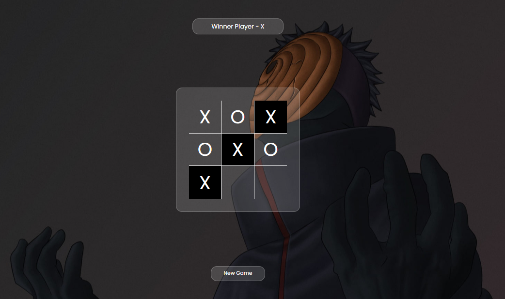

# **Tic-Tac-Toe !**

## ***About Game*** :
Tic-Tac-Toe is a two-player game in which the players fill up nine empty rectangles in a table with either an X or an O when it is their turn. Once someone succeeds to line up their sign vertically or horizontally without an interruption, that player wins.

## ***User-Interface***

## ***Rules To Play*** :- 
> * Two players take turns: placing 'X' and 'O' marks in empty spaces on a 3x3 square grid.
> * Player with the 'X' mark starts first. The first player to place 3 marks in a vertical, horizontal, or diagonal row wins the game.
> * If all spaces are filled, the game ends in a draw.

## ***Technology Used*** :
1. HTML - Handles the Structure of Game [index.html].
2. CSS - Handles the User-Interface i.e design,display,etc [style.css].
3. JAVASCRIPT - Handles the overall functionality of the Game [script.js].

## ***What's New ?***
* Draw detection: If all squares are filled without a winner, the game ends in a draw.
* Restart option: After the game ends, players have the option to restart and play again.
* Win detection: The game automatically detects when a player has won and displays a victory message.

## ***How to Run***?

> * To run my application you simply need to clone the repository and run the html file (index.html).

